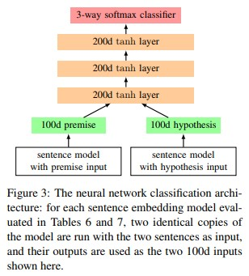

# Natural-Language-Inference

> From September 2018, I started working as a research intern in the Alibaba Search Group. The main research field is very related to NLI. This project is to reproduce some models of current NLI and introduces these related NLI models.

## Introduction

> The Natural Language Inference models can be used in many problems in different fields. such as question-answer, text entailment inference and so on. this repository mainly focuses on text entailment inference.

> There are usually three types of data (Premise, Hypothesis and label) to complete this task. The relationship of different component can be found as follows:

  

  

> In the next section, I will mainly introduce the feature-based model, encoder-based model, and attention-based model.

## Feature-based model

> Feature-based model was traditional method and had a limit performace. However, the feature of this methods is also very interesting. I will list the features in this paper.

> [Bowman S R, Angeli G, Potts C, et al. A large annotated corpus for learning natural language inference[J]. arXiv preprint arXiv:1508.05326, 2015.](https://nlp.stanford.edu/pubs/snli_paper.pdf)

> I wrote the [code](models/feature_based.py) to build these following features:

> 1. The BLEU score of the hypothesis with respect to the premise, using an n-gram length between 1 and 4.

> 2. The length difference between the hypothesis and the premise, as a real-valued feature.

> 3. The overlap between words in the premise and hypothesis, both as an absolute count and a percentage of possible overlap, and both
over all words and over just nouns, verbs, adjectives, and adverbs.

> 4. An indicator for every unigram and bigram in the hypothesis.

> 5. Cross-unigrams: for every pair of words across the premise and hypothesis which share a POS tag, an indicator feature over the
two words.

> 6. Cross-bigrams: for every pair of bigrams across the premise and hypothesis which share a POS tag on the second word, an indicator
feature over the two bigrams.

## Encoder-based model
> The encoder-based models were mainly built based on LSTM, CNN, Tree-LSTM and so on. In this section, i will introduce three papers as follows. These three models are representative.

> 1. [Bowman S R, Angeli G, Potts C, et al. A large annotated corpus for learning natural language inference[J]. arXiv preprint arXiv:1508.05326, 2015.](https://nlp.stanford.edu/pubs/snli_paper.pdf)

  

## Attention-based model

