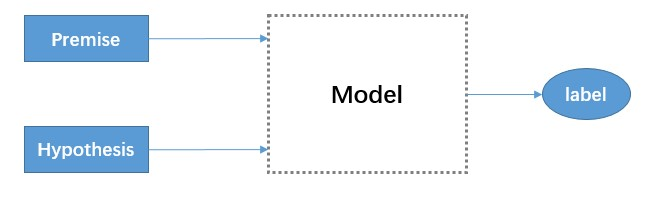

# Natural-Language-Inference

> From September 2018, I started working as a research intern in the Alibaba Search Group. The main research field is very related to NLI. This project is to reproduce some models of current NLI and introduces these related NLI models.

## Introduction

> The Natural Language Inference models can be used in many problems in different fields. such as question-answer, text entailment inference and so on. this repository mainly focuses on text entailment inference.

> There are usually three types of data (Premise, Hypothesis and label) to complete this task. The relationship of different component can be found as follows:

> In the next section, I will mainly introduce the feature-based model, encoder-based model, and attention-based model.

## Feature-based model

> Feature-based model was traditional method and had a limit performace. However, the feature of this methods is also very interesting. I will list the features in this paper.

> [Bowman S R, Angeli G, Potts C, et al. A large annotated corpus for learning natural language inference[J]. arXiv preprint arXiv:1508.05326, 2015.](https://nlp.stanford.edu/pubs/snli_paper.pdf)

'''
I wrote the [code](model/feature_based.py) to build these following features:

1. The BLEU score of the hypothesis with respect to the premise, using an n-gram length between 1 and 4.
'''

## encoder-based model

## attention-based model

